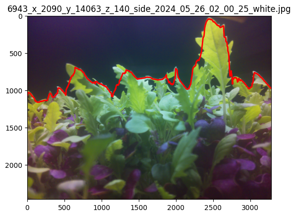

# Height Prediction Study Pipeline

This repository contains a script that automates the retrieval, filtering, matching, and visualization of plant images from an S3 bucket, forming part of the larger pipeline for the height prediction study. The script is designed to facilitate data preparation by managing image metadata, integrating SQL data, and ensuring efficient image handling.

Run scripts in this order:
1. **image_retrieval.ipynb**
2. 
    - **filtering_training.ipynb** (optional)
    - **filtering_model.ipynb**
3. **SAM_DINO.ipynb**
4. **array_visualization.ipynb** (optional)
5. **RF_models_training.ipynb**
6. **CNN_models_training.ipynb**

## 1. image_retrieval.ipynb

This script automates several key steps in the height prediction study pipeline:

1. **Initialize AWS and Set Working Directory**: Ensure your AWS credentials are configured and the working directory is set correctly.
2. **Load Image Metadata**: Load and filter image metadata from your specified S3 path.
3. **Retrieve SQL Data**: Define the date range and other SQL query parameters, then fetch the data from the SQL database.
4. **Merge Data**: Combine the SQL data with the image metadata.
5. **Filter and Match Images**: Apply filters based on plant profile, position coordinates, date range, layer IDs, and desired number of matches. Options for filtering include:
   - **Plant Profile Filter**: Specify a plant profile name to filter images.
   - **X and Y Position Filters**: Optionally filter by specific X and Y coordinates.
   - **Date Range**: Define start and end dates for SQL data retrieval.
   - **Layer IDs**: Specify which layer IDs to include in the SQL query.
   - **Max Side and Top Images**: Limit the number of side and top images to download.
   - **Desired Matches**: Define the number of matched images needed.
6. **Download Matched Images**: Download the matched images from the S3 bucket to local directories.
7. **Visualize Images**: Plot random samples of the downloaded images for visual inspection.
8. **Save Matches to CSV**: Save the matched image details to a CSV file for further analysis.

### Parameters

The `main` function accepts several parameters to customize the execution:
- `aws_credentials`: AWS credentials class or object.
- `working_directory`: Path to the working directory.
- `start_path`: S3 path for images.
- `base_dir`: Base directory for image storage.
- `sub_dirs`: Subdirectories for side and top images.
- `plant_profile_filter`: Filter for plant profile names.
- `start_date`: Start date for SQL data retrieval.
- `end_date`: End date for SQL data retrieval.
- `layer_ids`: List of layer IDs to include in the SQL query.
- `x_position`: Optional filter for x position.
- `y_position`: Optional filter for y position.
- `max_side_images`: Optional maximum number of side images to download.
- `max_top_images`: Optional maximum number of top images to download.
- `desired_matches`: Optional desired number of matches between side and top images.
- `remove_duplicates`: Boolean to remove duplicate images.
- `output_csv_path`: Path to save the matches CSV file.

### Output

- A CSV file containing details of the matched images.
- Local directories with downloaded side and top images.
- Visual plots of random image samples.

## 2a. filtering_training.ipynb (optional)

This script is used to train the filtering model for classifying images into good and bad categories. It's optional if you already have a trained model, but essential if you need to train a new one.

### Key Steps

1. **Sample Images**: Randomly sample images from the source folder for training.
2. **Plot Sampled Images**: Visualize sampled images to inspect the quality.
3. **Train the CNN Model**: Define and train a Convolutional Neural Network (CNN) model on the sampled images.
4. **Evaluate the Model**: Evaluate the trained model on validation and test sets.
5. **Save the Model**: Save the trained model to a file.

### Parameters

- `source_folder`: Path to the directory containing images to sample.
- `destination_folder`: Path to the directory to store sampled images.
- `sample_size`: Number of images to sample for training.

### Output

- **Trained Model**: The trained CNN model saved to a file.
- **Metrics and Plots**: Training and validation loss plots, model accuracy.

## 2b. filtering_model.ipynb

This script uses a pre-trained filtering model to classify images into good and bad categories. It can move or copy the classified images into corresponding directories and save the classification results to a CSV file.

### Key Steps

1. **Load the Pre-trained Model**: Load the pre-trained CNN model.
2. **Define Dataset and Transformations**: Set up dataset and transformations for the images to be classified.
3. **Classify Images**: Classify images using the model and move/copy them to appropriate directories.
4. **Save Predictions**: Save the classification results to a CSV file.
5. **Visualize Predictions**: Optionally visualize a sample of good and bad classified images.

### Parameters

- `input_dir`: Path to the directory containing images to be classified.
- `output_good_dir`: Path to the directory to store classified good images.
- `output_bad_dir`: Path to the directory to store classified bad images.
- `action`: 'move' or 'copy' to specify whether to move or copy the images.
- `output_csv`: Path to the CSV file to save classification results.

### Output

- **Classified Images**: Images classified as good or bad, moved or copied to respective directories.
- **CSV File**: CSV file containing image names and their classification results.
- **Visual Plots**: Optional visual plots of a sample of classified good and bad images.

## 3. **SAM_DINO.ipynb**

This script processes images and generates masks using the SAM (Segment Anything Model) and GroundingDINO models. It calculates height arrays from side images, which are essential for training and evaluating height prediction models. By producing precise masks and accurate height data, this script ensures that the height prediction models are built on reliable and high-quality data.

### Key Steps

1. **Install Dependencies and Setup Environment**:
   - Clone the GroundingDINO repository if it doesn't exist.
   - Install required packages, including GroundingDINO, Segment-Anything, and Supervision.
   - Verify installations and set up paths for configuration and weights.

2. **Load Data and Initialize Variables**:
   - Define paths to image folders and CSV files.
   - Load the CSV file containing image metadata and filter the list of valid side images.
   - Initialize directories for height arrays and processed images.

3. **Process Images and Generate Masks**:
   - Define functions to enhance class names, segment images, and calculate mask heights.
   - Loop through filtered images, read each image, and perform detection and segmentation.
   - Save height arrays and update the list of processed images.

4. **Annotate Images and Save Results**:
   - Create and save annotations for each processed image in Pascal VOC XML format.
   - Update and save the list of processed image names to a CSV file.

### Parameters

The script does not require user-specified parameters within the notebook, but it assumes the presence of certain files and directories. Ensure the following paths and files are correctly set:
- `side_images_folder`: Path to the folder containing side images.
- `csv_file`: Path to the CSV file with matched side-top images.
- `height_arrays_folder`: Directory to save height arrays.
- `processed_images_csv_path`: Path to the CSV file tracking processed images.

### Output

- **Height Arrays**: Height arrays calculated from side images are saved as `.npy` files.
- **Annotations**: Annotated images are saved in Pascal VOC XML format.
- **Processed Images CSV**: An updated CSV file with the list of processed image names.
- **Console Logs**: Indications of progress and completion of image processing, mask generation, and annotation.

## 4. **array_visualization.ipynb** (optional)

This script is used for visualizing the height arrays generated from the previous steps. It's an optional but useful tool for inspecting the quality and distribution of the height data.

### Key Steps

1. **Load Height Arrays**:
   - Load the height arrays from the specified directory.
   - Visualize the arrays using plots to inspect the data distribution.

2. **Generate Plots**:
   - Create plots for a subset of the height arrays.
   - Customize plot settings to enhance visualization.

### Parameters

- `height_arrays_folder`: Path to the directory containing height arrays.
- `sample_size`: Number of height arrays to visualize (default is set within the script).

### Output

- Visual plots of the height arrays.
- Console logs indicating the progress of the visualization process.

### Example Visualization

To help understand what is visualized, below is an example of an image with its corresponding height array plot.

In this example, the red line represents the calculated height array overlaid on the side image of the plants. This visualization helps in verifying the accuracy and quality of the height array calculations.

## 5. RF_models_training.ipynb

This script focuses on training Random Forest (RF) models for predicting plant heights and classifying height categories based on processed image data. The RF models serve as key components in the height prediction study, using the processed image features to make accurate predictions. 

### Regression Models

Two RF regression models are trained

 to predict plant heights:
- **224-Segment Model**: Predicts 224 height values per image.
- **5-Segment Model**: Predicts 5 height values per image.

### Classification Models

Two RF classification models are trained to classify plant heights into three categories (Short, Medium, Tall) based on:
- **Side Images**: demo_RF_3class_side_model
- **Top Images**: demo_RF_3class_top_model

### Key Steps

#### Regression Models

1. **Load and Preprocess Data**:
   - Load the height arrays and corresponding metadata from the CSV file generated in previous steps.
   - Perform any necessary preprocessing, such as normalization or scaling of features.

2. **Feature Engineering**:
   - Extract relevant features from the height arrays and metadata.
   - Engineer new features that might enhance the model's predictive power.

3. **Split Data**:
   - Split the dataset into training, validation, and test sets.
   - Ensure the splits are stratified or randomized appropriately to maintain data integrity.

4. **Train the Random Forest Models**:
   - Define the Random Forest model parameters and hyperparameters.
   - Train two separate models:
     - **224-Segment Model**: Predicts 224 height values per image.
     - **5-Segment Model**: Predicts 5 height values per image.
   - Use cross-validation to tune hyperparameters for both models.

5. **Evaluate the Models**:
   - Evaluate the trained models on the validation and test sets.
   - Calculate key metrics such as Mean Squared Error (MSE), Root Mean Squared Error (RMSE), Mean Absolute Error (MAE), and R-squared (R²).
   - Plot feature importances to understand the models' decision-making processes.

6. **Save the Models**:
   - Save the trained RF models to files for later use in predictions and comparisons.

7. **Model Interpretation and Visualization**:
   - Generate plots to visualize model performance, such as predicted vs. actual heights.
   - Analyze feature importances and other interpretive visualizations.

#### Classification Models

1. **Load and Preprocess Data**:
   - Load the image data and corresponding height labels from the specified directories.
   - Perform any necessary preprocessing, such as normalization and augmentation.

2. **Feature Extraction**:
   - Extract Histogram of Oriented Gradients (HOG) features from the images.

3. **Label Heights**:
   - Label the height arrays into three categories: Short, Medium, Tall.

4. **Split Data**:
   - Split the dataset into training, validation, and test sets, ensuring balanced class distributions.

5. **Train the Random Forest Classifier**:
   - Define the Balanced Random Forest Classifier parameters and hyperparameters.
   - Train the model using cross-validation to tune hyperparameters.

6. **Evaluate the Classifier**:
   - Evaluate the trained classifier on the validation and test sets.
   - Calculate key metrics such as accuracy, confusion matrix, and classification report.
   - Plot confusion matrices and bar plots for visual analysis.

7. **Save the Classifier**:
   - Save the trained RF classifier to a file for later use.
   - Save the evaluation metrics and predictions to files for further analysis.

### Parameters

- `top_image_folder`: Path to the folder containing top view images.
- `height_folder`: Path to the folder containing height arrays.
- `output_dir`: Directory to save the results and trained models.
- `best_params`: Dictionary containing the best hyperparameters for the Random Forest models.
- `img_size`: Size to resize the images to.
- `num_segments`: Number of segments to divide the height arrays into for regression models.
- `image_folders`: Dictionary containing paths to the side and top image folders for classification models.
- `model_save_paths`: Dictionary containing paths to save the trained models for classification.
- `results_save_paths`: Dictionary containing paths to save the cross-validation results for classification.
- `plot_save_paths`: Dictionary containing paths to save confusion matrix plots.
- `test_results_paths`: Dictionary containing paths to save test results.
- `metrics_save_paths`: Dictionary containing paths to save evaluation metrics.
- `bar_plot_save_paths`: Dictionary containing paths to save bar plots of actual vs. predicted labels.

### Output

- **Trained Random Forest Regression Models**:
  - **224-Segment Model**: Saved model file for high-resolution predictions (224 values per image).
  - **5-Segment Model**: Saved model file for lower-resolution predictions (5 values per image).
- **Trained Random Forest Classification Models**:
  - **Side Image Classifier**: demo_RF_3class_side_model
  - **Top Image Classifier**: demo_RF_3class_top_model
- **Metrics and Plots**: Evaluation metrics and visual plots of model performance.
- **CSV Files**: CSV files containing true and predicted heights for the test sets of both regression models.
- **JSON Files**: JSON files containing true and predicted labels for the test sets of both classification models.

Here is the updated README with the CNN classification part included:

## 6. CNN_models_training.ipynb

This script focuses on training a Convolutional Neural Network (CNN) model for predicting plant heights based on top-view images and height arrays. The CNN model serves as a key component in the height prediction study, using the processed image features to make accurate predictions.

### Regression Model

A CNN regression model is trained to predict plant heights:
- **k-Segment Model**: Predicts k height values per image (in this case, k = 3).

### Key Steps

1. **Load and Preprocess Data**:
   - Load the height arrays and corresponding metadata from the CSV file generated in previous steps.
   - Perform any necessary preprocessing, such as normalization or scaling of features.

2. **Feature Engineering**:
   - Extract relevant features from the height arrays and metadata.
   - Engineer new features that might enhance the model's predictive power.

3. **Split Data**:
   - Split the dataset into training, validation, and test sets using 5-fold cross-validation.
   - Ensure the splits are stratified or randomized appropriately to maintain data integrity.

4. **Train the CNN Model**:
   - Define the CNN model parameters and architecture.
   - Train the model with the training set and validate it using the validation set.
   - Use cross-validation to tune hyperparameters.

5. **Evaluate the Model**:
   - Evaluate the trained model on the validation and test sets.
   - Calculate key metrics such as Mean Squared Error (MSE), Root Mean Squared Error (RMSE), Mean Absolute Error (MAE), and R-squared (R²).
   - Plot the training and validation loss curves.

6. **Save the Model**:
   - Save the trained CNN model to a file for later use in predictions and comparisons.

7. **Model Interpretation and Visualization**:
   - Generate plots to visualize model performance, such as predicted vs. actual heights.
   - Analyze feature importances and other interpretive visualizations.

### Classification Model

A CNN classification model is trained to classify plant heights into three categories (Short, Medium, Tall) based on:
- **Side Images**: demo_CNN_3class_side_model
- **Top Images**: demo_CNN_3class_top_model

### Key Steps

1. **Load and Preprocess Data**:
   - Load the image data and corresponding height labels from the specified directories.
   - Perform any necessary preprocessing, such as normalization and augmentation.

2. **Feature Extraction**:
   - Extract Histogram of Oriented Gradients (HOG) features from the images.

3. **Label Heights**:
   - Label the height arrays into three categories: Short, Medium, Tall, using adjusted thresholds.

4. **Split Data**:
   - Split the dataset into training, validation, and test sets, ensuring balanced class distributions.

5. **Train the CNN Classifier**:
   - Define the CNN model parameters and architecture.
   - Train the model with the training set and validate it using the validation set.
   - Use cross-validation to tune hyperparameters.

6. **Evaluate the Classifier**:
   - Evaluate the trained classifier on the validation and test sets.
   - Calculate key metrics such as accuracy, precision, recall, F1 score, and confusion matrix.
   - Plot confusion matrices and bar plots for visual analysis.

7. **Save the Classifier**:
   - Save the trained CNN classifier to a file for later use.
   - Save the evaluation metrics and predictions to files for further analysis.

### Parameters

- `image_folder`: Path to the folder containing top view images.
- `height_folder`: Path to the folder containing height arrays.
- `csv_path`: Path to the CSV file containing image and height array filenames.
- `model_save_path`: Path to save the trained CNN model.
- `test_image_save_path`: Path to save the test image names and results.
- `best_params`: Dictionary containing the best hyperparameters for the CNN model.
- `num_segments`: Number of segments to divide the height arrays into for the regression model.
- `image_folders`: Dictionary containing paths to the side and top image folders for classification models.
- `model_save_paths`: Dictionary containing paths to save the trained models for classification.
- `results_save_paths`: Dictionary containing paths to save the cross-validation results for classification.
- `plot_save_paths`: Dictionary containing paths to save confusion matrix plots.
- `metrics_save_paths`: Dictionary containing paths to save evaluation metrics.
- `bar_plot_save_paths`: Dictionary containing paths to save bar plots of actual vs. predicted labels.

### Output

- **Trained CNN Regression Model**:
  - **k-Segment Model**: Saved model file for k-segment predictions.
- **Trained CNN Classification Models**:
  - **Side Image Classifier**: demo_CNN_3class_side_model
  - **Top Image Classifier**: demo_CNN_3class_top_model
- **Metrics and Plots**: Evaluation metrics and visual plots of model performance.
- **CSV Files**: CSV files containing true and predicted heights for the test sets.
- **JSON Files**: JSON files containing evaluation metrics and test results for classification models.
---

By following these scripts in the specified order, you can efficiently process and prepare plant image data for the height prediction study. Each script is designed to handle specific tasks, from data retrieval and preprocessing to visualization, ensuring a streamlined workflow for the height prediction pipeline.

For more detailed instructions and examples, refer to the full documentation provided within each notebook. If you encounter any issues or need further assistance, please consult the repository's [Issues](https://github.com/your-repository/issues) section or reach out to the project maintainers.
